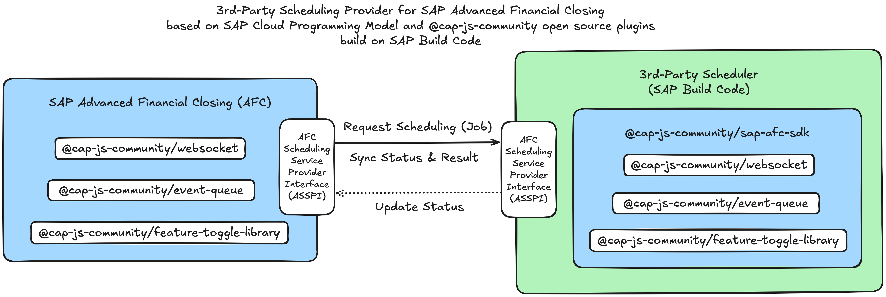
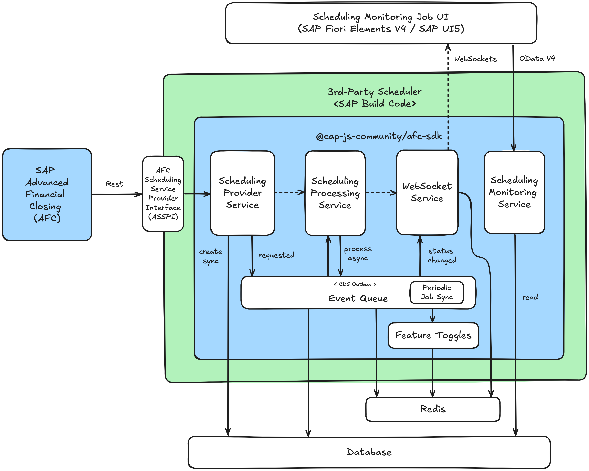

# SAP Advanced Financial Closing SDK for CDS

[](https://www.npmjs.com/package/@cap-js-community/sap-afc-sdk)
[](https://www.npmjs.com/package/@cap-js-community/sap-afc-sdk)
[](https://api.reuse.software/info/github.com/cap-js-community/sap-afc-sdk)
[](https://github.com/cap-js-community/sap-afc-sdk/commits/main)

### [SAP Advanced Financial Closing SDK for CDS](https://www.npmjs.com/package/@cap-js-community/sap-afc-sdk)

> Provides an SDK for SAP Advanced Financial Closing to be consumed with
> SAP Cloud Application Programming Model (Node.js).

> ## Table of Contents

- [Getting Started](#getting-started)
- [Architecture](#architecture)
- [Usage](#usage)
  - [Options](#options)
  - [Implementation](#implementation)
- [Documentation](#documentation)
  - [Boostrap Project](#bootstrap-project)
  - [Add Features](#add-features)
  - [Deployment](#deployment)
  - [Advanced Setup](#advanced-setup)

## Getting Started

- Run `npm add @cap-js-community/sap-afc-sdk` in `@sap/cds` project
- Execute `cds-serve` to start server
  - Access welcome page at http://localhost:4004
  - Access UIs
    - [/launchpad.html](http://localhost:4004/launchpad.html): Sandbox Launchpad
    - [/scheduling.monitoring.job/webapp](http://localhost:4004/scheduling.monitoring.job/webapp): Standalone
      Scheduling Monitoring Job UI
  - Access Service Endpoints
    - Public API
      - [/api/job-scheduling/v1](http://localhost:4004/api/job-scheduling/v1): Scheduling Provider
        API ([OpenAPI](http://localhost:4004/api-docs/api/job-scheduling/v1))
    - OData API (UI)
      - [/srv/job-scheduling/monitoring](http://localhost:4004/srv/job-scheduling/monitoring): Feature Toggle
        API ([$metadata](http://localhost:4004/srv/job-scheduling/monitoring/$metadata))
    - WebSocket API
      - [/ws/job-scheduling](http://localhost:4004/ws/job-scheduling): Scheduling WebSocket endpoint
    - REST API
      - [/rest/feature](http://localhost:4004/rest/feature): Feature Toggle API
    - Internal API
      - `SchedulingProcessingService`: Scheduling Processing service
        ```js
        const schedulingWebsocketService = await cds.connect.to("SchedulingWebsocketService");
        ```
      - `SchedulingWebsocketService`: Scheduling Websocket service
        ```js
        const schedulingProcessingService = await cds.connect.to("SchedulingProcessingService");
        ```

## Architecture

[SAP Advanced Financial Closing (AFC)](https://help.sap.com/docs/advanced-financial-closing) lets you define, automate,
process, and monitor the entity close for your organization.

The SAP Advanced Financial Closing SDK for CDS provides a plugin
for [SAP Cloud Application Programming Model (CAP)](https://cap.cloud.sap) (Node.js)
to extend and integrate with SAP Advanced Financial Closing (AFC). Specifically, it provides an out-of-the-box
implementation
of the [SAP Advanced Financial Closing Scheduling Service Provider Interface](./openapi/SchedulingProviderService.openapi3.json) to expose a
Scheduling Provider service
to manage Job definitions and Jobs. Furthermore, it brings the following out-of-the-box virtues:

- **API**: Exposes a RESTful API implementing the AFC Scheduling Provider Interface to manage Job definitions and Jobs
- **Event-Queue**: Provides an event queue to process Jobs asynchronously and resiliently (circuit breaker, retry,
  load-balancing, etc.)
- **Websocket**: Provides websocket connection support to monitor Job processing live
- **Feature-Toggle**: Provides a feature toggle library to control the execution of the Event Queue
- **UI**: Provides a UI5 application to monitor and cancel Jobs
- **Broker**: Implements a service broker to manage service key management to API

### Concept

The SAP Advanced Financial Closing SDK for CDS is build on the following architecture open source
building blocks as depicted in the following diagram:



- **WebSocket Adapter for CDS** (https://github.com/cap-js-community/websocket)
  - Exposes a WebSocket protocol via WebSocket standard or Socket.IO for CDS services. Runs in context of the SAP
    Cloud Application Programming Model (CAP) using @sap/cds (CDS Node.js).
- **Event Queue for CDS** (https://github.com/cap-js-community/event-queue)
  - The Event-Queue is a framework built on top of CAP Node.js, designed specifically for efficient and streamlined
    asynchronous event processing
- **Feature Toggle Library for CDS** (https://github.com/cap-js-community/feature-toggle-library)
  - SAP BTP feature toggle library enables Node.js applications using the SAP Cloud Application Programming Model to
    maintain live-updatable feature toggles via Redis

You can develop a 3rd-Party Scheduling Provider for SAP Advanced Financial Closing using the SAP Advanced Financial
Closing SDK, built on the SAP Cloud Programming Model and enhanced with @cap-js-community open-source plugins,
leveraging SAP Build Code for a seamless and scalable solution.

Requesting job scheduling, synchronizing status and results, and updating job definitions between SAP Advanced Financial
Closing (AFC) and a 3rd-party
scheduling provider can be easily implemented using the AFC SDK.

The open source components are shared between SAP Advanced Financial Closing and the SAP Advanced Financial Closing SDK
for CDS.

### Design

The architectural design of the SAP Advanced Financial Closing (AFC) SDK for implementing a Scheduling Provider is based
on the SAP Cloud Application Programming Model (CAP) and SAP Build Code.
It leverages the [@cap-js-community](https://github.com/cap-js-community) open-source components to enable scheduling
services in AFC.

The following diagram illustrates the high-level architecture of the SAP Advanced Financial Closing SDK for CDS:



**Key components and processing flow**:

- **SAP Advanced Financial Closing (AFC):**
  - Sends scheduling requests via AFC Scheduling Service Provider Interface using REST
    API ([Open API](./openapi/SchedulingProviderService.openapi3.json))
- **Scheduling Provider Service:**
  - Handles incoming scheduling requests
  - Creates scheduling jobs synchronously and places asynchronous requests into the Event Queue
- **Scheduling Processing Service:**
  - Processes scheduled jobs asynchronously
  - Retrieves job requests from the Event Queue and executes them.
- **Scheduling WebSocket Service:**
  - Listens for status updates of scheduled jobs
  - Notifies the Monitoring Scheduling Job UI via WebSockets when job statuses change
- **Scheduling Monitoring Service:**
  - Monitoring Scheduling Job UI (SAP Fiori Elements V4 / SAP UI5 application)
  - Reads scheduling job details from the database
  - Supports monitoring via OData V4 API
  - Displays scheduling job statuses and updates in real-time via WebSockets
- **Event Queue & Feature Toggles:**
  - Event Queue (using CDS Outbox) facilitates asynchronous job execution
  - Feature Toggles allow influence Job and Event Queue processing dynamically
- **Database & Redis Caching:**
  - Stores job scheduling data in the database
  - Redis is used for information distribution (e.g. Event Queue, WebSockets, Feature Toggles)

## Usage

### Options

Options can be passed to SDK via CDS environment via `cds.rerquires.sap-afc-sdk` section:

- `ui: Object | Boolean`: UI configuration. Use `false` to disable UI. Default `{}`
  - `ui.path: String`: Path to the served UI5 application. Default `''`
  - `ui.launchpad: Boolean`: Serve launchpad. Default `true`
  - `ui.scheduling.monitoring.job: Boolean`: Serve Scheduling Monitoring Job. Default `true`
  - `ui.api.scheduling.job.swagger: Boolean`: Serve Scheduling Provider Swagger UI. Default `true`
- `broker: Boolean | Object`: Broker configuration. Serve broker endpoint, if truthy. Default `false` and `true` in `production`
- `mockProcessing: Boolean | Object`: Activate mocked job processing. Default `false`
  - `mockProcessing.default: String`: Default processing status. Default `completed`
  - `mockProcessing.min: Number`: Minimum processing time in seconds. Default `0`
  - `mockProcessing.max: Number`: Maximum processing time in seconds. Default `30`
  - `mockProcessing.status: Object`: Status distribution values
    - `mockProcessing.status.completed: Number`: Completed status distribution value
    - `mockProcessing.status.completedWithWarning: Number`: Completed With Warning status distribution value
    - `mockProcessing.status.completedWithError: Number`: Completed With Error status distribution value
    - `mockProcessing.status.failed: Number`: Failed status distribution value
- `config: Object`: SDK configuration
- `csp: Object | Boolean`: Content Security Policy (CSP). Default `true`
- `cors: Object | Boolean`: Cross-Origin Resource Sharing (CORS) configuration. Default `true`

### Implementation

#### Mock Job Processing

The library includes a mocked processing for jump-start development, which is disabled by default via option.
`cds.requires.sap-afc-sdk.mockProcessing: false`

Setting option `cds.requires.sap-afc-sdk.mockProcessing: true` the mocked Job processing completes
jobs based on a random time value between `0-30` seconds.

A more advanced mocked Job processing can be configured by setting the
following [CDS env](https://cap.cloud.sap/docs/node.js/cds-env)
options (as described in [options](#options)):

```json
{
  "cds": {
    "requires": {
      "sap-afc-sdk": {
        "mockProcessing": {
          "min": 0,
          "max": 30,
          "status": {
            "completed": 0.5,
            "completedWithWarning": 0.2,
            "completedWithError": 0.2,
            "failed": 0.1
          }
        }
      }
    }
  }
}
```

This default advanced mocked Job processing can be also configured by using CDS profile `mock` via `--profile mock` or
`CDS_ENV=mock`.

#### Implement Job Processing

The default implementation of the Job processing is already provided by the SDK. Focus can be put on
custpm processing logic, and the processing status update handling.

To implement a custom Job processing extend the Job processing service definition as follows:

- CDS file: `/srv/scheduling-processing-service.cds`

  ```cds
  using SchedulingProcessingService from '@cap-js-community/sap-afc-sdk';
  annotate SchedulingProcessingService with @impl: '/srv/scheduling-processing-service.js';
  ```

Service can be restricted for authorization adding `@requires` annotation.

- Implementation file: `/srv/scheduling-processing-service.js`

  ```js
  "use strict";

  const { SchedulingProcessingService, JobStatus } = require("@cap-js-community/sap-afc-sdk");

  class CustomSchedulingProcessingService extends SchedulingProcessingService {
    async init() {
      const { processJob, updateJob, cancelJob } = this.operations;

      this.on(processJob, async (req, next) => {
        // Your logic goes here
        // await this.processJobUpdate(req, JobStatus.completed, [{ ... }]);
        await next();
      });

      this.on(updateJob, async (req, next) => {
        // Your logic goes here
        await next();
      });

      this.on(cancelJob, async (req, next) => {
        // Your logic goes here
        await next();
      });

      super.init();
    }
  }

  module.exports = CustomSchedulingProcessingService;
  ```

As part of the custom scheduling process service implementation, the following operations can be implemented:

- `on(processJob)`:
  - A new Job instance was created and needs to be processed
  - The Job is due (start date time is reached), and the Job is ready for processing
  - Implement your custom logic, how the Job should be processed
  - Job data can be retrieved via `req.job`
  - Call `await next()` to perform default implementation (set status to `running`)
  - Job update can be performed via `this.processJobUpdate()` providing the new status and Job results
    - e.g. `await this.processJobUpdate(req, JobStatus.completed, [{...}])`
  - Throwing exceptions will automatically trigger the retry process in event queue
  - Disable mocked Job processing via `cds.requires.sap-afc-sdk.mockProcessing: false` (default).
- `on(updateJob)`:
  - A job status update is requested and the Job results are stored
  - Implement your custom logic, how the Job status should be updated
  - Job data can be retrieved via `req.job`
  - Job status transition is validated via `async checkStatusTransition(req, statusBefore, statusAfter)`
    - Valid status transitions are defined in `this.statusTransitions`
    - Check function and status transitions can be customized
  - Job results are checked and processed via `async checkJobResults(req, results)`
    - Valid results are valid according to Job Results signature constraints (see below)
    - Returns the processed Job Results to be inserted
  - Call `await next()` to perform default implementation (update status to requested status)
- `on(cancelJob)`:
  - A job cancellation is requested
  - Implement your custom logic, how the Job should be canceled
  - Job data can be retrieved via `req.job`
  - Call `await next()` to perform default implementation (update status to `canceled`)

The Job Results signature is defined as follows:

```cds
type ResultTypeCode   : String enum {
  link;
  data;
  message;
};

type MessageSeverityCode : String enum {
  error;
  warning;
  info;
};

type JobResult {
  name     :      String not null;
  type     :      ResultTypeCode not null;
  link     :      String;
  mimeType :      String;
  filename :      String;
  data     :      LargeBinary;
  messages : many JobResultMessage;
};

type JobResultMessage {
  text     : String not null;
  severity : MessageSeverityCode not null;
};
```

Multiple Job Results can be passed for Job update.
The following constraints apply for each Job result type:

- `link`:
  - Properties `name` and `link` need to be provided
  - Other properties are not allowed
- `data`:
  - Properties `name`, `mimeType`, `filename` and `data` need to be provided
  - Data needs to be provided as base64 encoded string
  - Other properties are not allowed
- `message`:
  - Properties `name` and `messages` need to be provided
  - Messages need to be provided as array of Job result messages
  - Other properties are not allowed

Job processing is performed as part of the Event Queue processing. The Event Queue is a framework built on top of CAP
Node.js, designed specifically for efficient and streamlined asynchronous event processing. In case of errors, the Event Queue
provides resilient processing (circuit breaker, retry, load-balancing, etc.).

In addition, to overwriting the default implementation via an `on` handler, also additional `before` and `after` handlers can be registered.

#### Implement Job Provider

The default implementation of the Job provider is already provided by the SDK.
Focus can be put on additional custom provider logic, e.g. streaming of data from a remote location.

To implement a custom Job provider extend the Job provider service definition as follows:

- CDS file: `/srv/scheduling-provider-service.cds`

  ```cds
  using SchedulingProviderService from '@cap-js-community/sap-afc-sdk';
  annotate SchedulingProviderService with @impl: '/srv/scheduling-provider-service.js';
  ```

Service can be restricted for authorization adding `@requires` annotation.

- Implementation file: `/srv/scheduling-provider-service.js`

```js
"use strict";

const { SchedulingProviderService, JobStatus } = require("@cap-js-community/sap-afc-sdk");

class CustomSchedulingProviderService extends SchedulingProviderService {
  async init() {
    const { Job, JobResult } = this.entities;

    this.on("CREATE", Job, async (req, next) => {
      // Your logic goes here
      await next();
    });

    this.on(Job.actions.cancel, Job, async (req, next) => {
      // Your logic goes here
      await next();
    });

    this.on(JobResult.actions.data, JobResult, async (req) => {
      // Your logic goes here
      await next();
    });

    super.init();
  }
}

module.exports = CustomSchedulingProviderService;
```

As part of the custom scheduling provider service implementation, the following operations can be implemented:

- `on("CREATE", Job)`:
  - Validates and creates a new Job instance
  - Call `await next()` to perform default implementation
  - `after`: Calls scheduling processing service function `processJob`
- `on(Job.actions.cancel, Job)`:
  - Cancels a job
  - Call `await next()` to perform default implementation
  - `after`: Calls scheduling processing service function `cancelJob`
- `on(JobResult.actions.data, JobResult)`:
  - Call `await next()` to perform default implementation
  - Streams data of a job result (type `data`) from DB to response

In addition, to overwriting the default implementation via an `on`-handler, also additional `before` and `after` handlers can be registered.

#### Implement Periodic Job Sync

- wip

## Documentation

### Bootstrap Project

A new CDS project can be initialized using [SAP Build Code](https://help.sap.com/docs/build_code)
tools on SAP Business Technology Platform (BTP) or `@sap/cds-dk` CLI command `cds init` can be used to boostrap a new
CAP application.

**SAP Build Code**:

- Open SAP Build Code Lobby
- Press `Create`
- Select `Build an Application`
  - Choose `SAP Build Code`
  - Choose `Full-Stack Application`
- Provide Project Name
- Select Development Stack: `Node.js`
- Press `Create`
- Continue with `cds` CLI, [adding features](#add-features)

**CDS Command-Line-Interface**:

- Terminal: `npm install -g @sap/cds-dk`
- Init a new CDS project:
  - Terminal: `cds init <name>`
- Switch to project folder:
  - Terminal: `cd <name>`

### Add Features

**AFC initialize**:

- Add AFC SDK
  - Terminal `npm install @cap-js-community/sap-afc-sdk`
- Init Target Environment:
  - Cloud Foundry:
    - Terminal: `afc init cf`
  - Kyma:
    - Terminal: `afc init kyma`
- Add AFC SDK features:
  - Terminal: `afc add broker,sample,http`
- Install: `npm install`
- Test
  - Terminal: `npm start`
  - Browser: `http://localhost:4004`

### Deployment

To fully test the application, also accessing API from external a deployment needs to be performed.
BTP offers different deployment options, depending on the target environment (Cloud Foundry or Kyma).

#### Cloud Foundry

- Add MTA feature
  - Terminal: `cds add mta`
- Build MTA
  - Terminal: `mbt build`
- Deploy MTA
  - Terminal: `cf deploy mta_archives/<mta>.mtar`
- Follow Guide for [Deployment to CF](https://cap.cloud.sap/docs/guides/deployment/to-cf)

#### Kyma

- Add helm feature
  - Terminal: `cds add helm`
- Containerize
  - Terminal: `ctz containerize.yaml --push`
- Upgrade
  - Terminal: `helm upgrade --install <name> ./gen/chart -n <namespace>`
- Deploy
  - Terminal: `kubectl rollout restart deployment -n <namespace>`
- Follow Guide for [Deployment to Kyma](https://cap.cloud.sap/docs/guides/deployment/to-kyma)

### Advanced Setup

#### Add sample data

To add sample Job definitions and Job instances run:

- Terminal: `afc add sample`

Test data will be placed at `/db/data`.

#### Add .http files

To add `.http` files for testing the API endpoints run:

- Terminal: `afc add http`

HTTP files will be placed at `/http`.

#### Broker (Cloud Foundry)

An Open Service Broker compliant broker implementation can be added to the CAP project.
The broker is used to manage service key management to the API.

- Terminal: `afc add broker`
- Deploy (see above)
- Create broker:
  - Terminal: `cf create-service-broker <name>-broker broker-user '<broker-password>' https://<domain>/broker --space-scoped`
- Create a service from broker: `cf cs <service-name> standard <name>`
- Create a service key: `cf create-service-key <name> <name>-key`
- Display service key: `cf service-key <name> <name>-key`
- Perform OAuth token request using service key credentials
  - See [uaa.http](./http/auth/uaa.http) for obtaining an OAuth token
- Call API using OAuth token
  - See `.http` files in [/http](./http) to call API endpoints
  - See `.http` files in [/http/scheduling](./http/scheduling) to call scheduling provider API endpoints

#### Authentication

Authentication can be performed omn BTP using XSUAA or IAS.

##### XSUAA

Add XSUAA based authentication:

- Terminal: `cds add xsuaa --for production`
- Change XSUAA service plan `servicePlanName` (helm) / `service-plan` (mta) from `application` to `broker`

##### Identify Services (IAS)

Add IAS based authentication:

- Terminal: `cds add ias`

#### Approuter

To serve UIs and provided authentication mechanisms via browser, and approuter needs to be added to project:

- Terminal: `cds add approuter`

Approuter is added in folder `/app/router`. It can be deployed as separate application.

#### Work Zone (Standard)

Add Work Zone integration to display UIs in a launchpad:

- Terminal: `cds add workzone-standard`

#### HTML5 Repo

For development and testing purposes UIs are served as part of the server. Exposed UIs can be accessed via the
server welcome page. For productive usage, UIs should be served via HTML5 repo:

- Terminal: `cds add html5-repo`
- Disable UI serving in server via CDS env: `cds.requires.sap-afc-sdk.ui: false`
- Apps from AFC SDK can be included into project at `/app` via (necessary for Kyma deployment):
  - Terminal: `afc add app`

#### Redis

You can scale the application by adding a Redis cache to distribute workload across application instances:

- Terminal: `cds add redis`

Redis is used by `event-queue`, `websocket` and `feature-toggle-library` modules
to process events, distribute websocket messages and store feature toggles.

#### Feature Toggles

The Feature Toggle Library is used to control the execution of the Event Queue. It exposes endpoints to manage feature
toggles.

`GET /rest/feature/state()`: Read current feature toggle state
`POST /rest/feature/redisUpdate`: Update feature toggle state

See `.http` files in [/http/toggles](./http/toggles) to call feature toggle endpoints.

#### Multi-tenancy

The project can be enabled for multi-tenancy by following the guide:
https://cap.cloud.sap/docs/guides/multitenancy/#enable-multitenancy

##### MTX Tool (CF only)

The MTX Tool is used to manage the application lifecycle. It can be used to manage the application in Cloud Foundry.
Details can be found at https://github.com/cap-js-community/mtx-tool.
