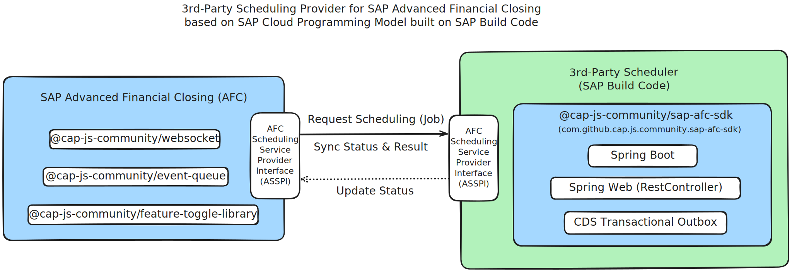

# SAP Advanced Financial Closing SDK for CDS

[](https://www.npmjs.com/package/@cap-js-community/sap-afc-sdk)
[](https://www.npmjs.com/package/@cap-js-community/sap-afc-sdk)
[](https://api.reuse.software/info/github.com/cap-js-community/sap-afc-sdk)
[](https://github.com/cap-js-community/sap-afc-sdk/commits/main)

## About this Project

[SAP Advanced Financial Closing SDK for CDS](https://www.npmjs.com/package/@cap-js-community/sap-afc-sdk) provides an SDK for [SAP Advanced Financial Closing](https://help.sap.com/docs/advanced-financial-closing) to
be consumed with [SAP Cloud Application Programming Model](https://www.npmjs.com/package/@sap/cds).

## Table of Contents

- [Requirements and Setup](#requirements-and-setup)
- [Getting Started](#getting-started)
- [CAP Node.js](#cap-nodejs)
  - [Usage](#usage)
  - [Architecture](#architecture)
  - [Options](#options)
  - [Implement](#implement)
    - [Job Processing](#job-processing)
    - [Job Provider](#job-provider)
    - [Periodic Job Sync](#periodic-job-sync)
    - [Notification](#notification)
  - [API](#api)
  - [Additional Settings](#additional-settings)
- [CAP Java](#cap-java)
  - [Usage](#usage-1)
  - [Architecture](#architecture-1)
  - [Options](#options-1)
  - [Implement](#implement-1)
    - [Job Processing](#job-processing-1)
    - [Job Provider](#job-provider-1)
    - [Periodic Job Sync](#periodic-job-sync-1)
    - [Notification](#notification-1)
  - [API](#api-1)
- [Deployment](#deployment)
- [Service Broker](#service-broker)
- [Miscellaneous](#miscellaneous)
  - [Testing](#testing)
  - [Authorization](#authorization)
  - [Work Zone](#work-zone)
  - [Multitenancy](#multitenancy)
- [Support, Feedback, Contributing](#support-feedback-contributing)
- [Code of Conduct](#code-of-conduct)
- [Licensing](#licensing)

## Requirements and Setup

[SAP Advanced Financial Closing (AFC)](https://help.sap.com/docs/advanced-financial-closing) lets you define, automate,
process, and monitor the entity close for your organization.

- To develop and test applications built with this SDK, you need a [CAP Node.js](https://www.npmjs.com/package/@sap/cds) or [CAP Java](https://www.npmjs.com/package/@sap/cds) project
- To integrate, you need access to an instance of [SAP Advanced Financial Closing](https://help.sap.com/docs/advanced-financial-closing)

## Getting Started

A new CDS project can be initialized using [SAP Build Code](https://help.sap.com/docs/build_code) tools on SAP Business Technology Platform (BTP)
or `@sap/cds-dk` CLI command `cds init` can be used to bootstrap a new CAP application. [See capire](https://cap.cloud.sap/docs/tools/cds-cli#cds-init).

### Bootstrap CDS

**SAP Build Code**:

- Open SAP Build Lobby
- Press `Create`
- Select objective `Application`
- Choose category `Full-Stack`
- Select type `Full-Stack Node.JS` or `Full-Stack Java`
- Provide the project name and dev space
- Press `Review`
- Press `Create`
- Open the project in SAP Business Application Studio

**CDS Command-Line-Interface**:

- Terminal: `npm install -g @sap/cds-dk`
- Init a new CDS project:
  - Terminal:
    - CAP Node.js: `cds init <name> --nodejs`
    - CAP Java: `cds init <name> --java`
- Switch to the project folder:
  - Terminal: `cd <name>`
- Install
  - Terminal: `npm install`

### Adding SDK

- Add AFC SDK
  - Terminal `npm install @cap-js-community/sap-afc-sdk`
- Use `afc` command
  - Add globally:
    - Terminal: `npm install -g @cap-js-community/sap-afc-sdk`
  - Use locally:
    - Terminal: `npx afc`
- Init target environment
  - Cloud Foundry (default):
    - Terminal: `afc init cf`
  - Kyma:
    - Terminal: `afc init kyma`
- Add SDK features
  - Terminal: `afc add sample,broker,http`
- Add stub implementation
  - Terminal: `afc add stub`

### Test Project

- Terminal: `npm start`
- Browser:
  - CAP Node.js: http://localhost:4004
  - CAP Java: http://localhost:8080

An introductory blog post is available on SAP Community: [SAP Advanced Financial Closing: Third-Party Integration](https://community.sap.com/t5/financial-management-blog-posts-by-sap/sap-advanced-financial-closing-third-party-integration/ba-p/14317791).

## CAP Node.js

The SAP Advanced Financial Closing SDK for CDS provides a plugin for [SAP Cloud Application Programming Model (CAP) for Node.js](https://cap.cloud.sap/docs/node.js)
to extend and integrate with SAP Advanced Financial Closing (AFC). Specifically, it provides an out-of-the-box
implementation of the [SAP Advanced Financial Closing Scheduling Service Provider Interface](https://hub.sap.com/api/SSPIV1)
to expose a Scheduling Provider service to manage Job definitions and Jobs.

Furthermore, it brings the following out-of-the-box features:

- **API**: Exposes a RESTful API implementing the AFC Scheduling Provider Interface to manage Job definitions and Jobs
- **Event-Queue**: Provides an Event Queue to process and synchronize Jobs (periodically) asynchronously and resiliently (circuit breaker, retry,
  load-balancing, etc.)
- **Websocket**: Provides websocket connection support to monitor Job processing live
- **Feature-Toggle**: Provides a feature toggle library to control the execution of the Event Queue
- **UI**: Provides a UI5 application to monitor and cancel Jobs
- **Broker**: Implements a service broker to manage service key management to API

### Usage

- Run `npm add @cap-js-community/sap-afc-sdk` in `@sap/cds` CAP Node.js project
- Execute `npm start` to start server
  - Access the welcome page at http://localhost:4004
  - Access Applications
    - [/launchpad.html](http://localhost:4004/launchpad.html): Sandbox Launchpad
    - [/scheduling.monitoring.job](http://localhost:4004/scheduling.monitoring.job): Standalone Scheduling Monitoring Job UI
  - Access Service Endpoints
    - Public API
      - [/api/job-scheduling/v1](http://localhost:4004/api/job-scheduling/v1): Scheduling Provider API ([OpenAPI Swagger UI](http://localhost:4004/api-docs/api/job-scheduling/v1))
    - OData API (UI)
      - [/odata/v4/job-scheduling/monitoring](http://localhost:4004/odata/v4/job-scheduling/monitoring): Job Scheduling Monitoring ([$metadata](http://localhost:4004/odata/v4/job-scheduling/monitoring/$metadata))
    - WebSocket API
      - [/ws/job-scheduling](http://localhost:4004/ws/job-scheduling): Scheduling WebSocket endpoint
    - REST API
      - [/rest/feature](http://localhost:4004/rest/feature): Feature Toggle API
    - CDS Internal API
      - `sapafcsdk.scheduling.ProcessingService`: Scheduling Processing service
        ```js
        const schedulingProcessingService = await cds.connect.to("sapafcsdk.scheduling.ProcessingService");
        ```
      - `sapafcsdk.scheduling.WebsocketService`: Scheduling Websocket service
        ```js
        const schedulingWebsocketService = await cds.connect.to("sapafcsdk.scheduling.WebsocketService");
        ```

### Architecture

The SAP Advanced Financial Closing SDK for CDS is built on the following architecture open source
building blocks as depicted in the following diagram:


- **WebSocket Adapter for CDS** (https://github.com/cap-js-community/websocket)
  - Exposes a WebSocket protocol via WebSocket standard or Socket.IO for CDS services. Runs in the context of the SAP
    Cloud Application Programming Model (CAP) using @sap/cds (CDS Node.js).
- **Event Queue for CDS** (https://github.com/cap-js-community/event-queue)
  - The Event-Queue is a framework built on top of CAP Node.js, designed specifically for efficient and streamlined
    asynchronous event processing
- **Feature Toggle Library for CDS** (https://github.com/cap-js-community/feature-toggle-library)
  - SAP BTP feature toggle library enables Node.js applications using the SAP Cloud Application Programming Model to
    maintain live-updatable feature toggles via Redis

Using the SAP Advanced Financial Closing SDK, a third-party scheduling provider can be built for SAP Advanced Financial Closing.
The architectural design of the SAP Advanced Financial Closing (AFC) SDK for implementing a Scheduling Provider is based
on the SAP Cloud Application Programming Model (CAP) and SAP Build Code. It leverages the [@cap-js-community](https://github.com/cap-js-community)
open-source components to enable scheduling services in AFC.

The following diagram illustrates the high-level architecture of the SAP Advanced Financial Closing SDK for CDS (Node.js):


**Key components and processing flow**:

- **SAP Advanced Financial Closing (AFC):**
  - Sends scheduling requests via AFC Scheduling Service Provider Interface using REST
    API ([OpenAPI](https://hub.sap.com/api/SSPIV1))
- **Scheduling Provider Service:**
  - Handles incoming scheduling requests
  - Creates scheduling jobs synchronously and places asynchronous requests into the Event Queue
- **Scheduling Processing Service:**
  - Processes scheduled jobs asynchronously
  - Retrieves job requests from the Event Queue and executes them.
- **Scheduling WebSocket Service:**
  - Listens for status updates of scheduled jobs
  - Notifies the Monitoring Scheduling Job UI via WebSockets when job statuses change
- **Scheduling Monitoring Service:**
  - Monitoring Scheduling Job UI (SAP Fiori Elements V4 / SAP UI5 application)
  - Reads scheduling job details from the database
  - Supports monitoring via OData V4 API
  - Displays scheduling job statuses and updates in real-time via WebSockets
- **Event Queue & Feature Toggles:**
  - Event Queue (instrumenting CDS Queue) facilitates asynchronous job execution
  - Feature Toggles allow influencing Job and Event Queue processing dynamically
- **Database & Redis Caching:**
  - Stores job scheduling data in the database
  - Redis is used for information distribution (e.g., Event Queue, WebSockets, Feature Toggles)

### Options

Options can be passed to SDK via CDS environment in `cds.requires.sap-afc-sdk` section:

- `capabilities: Object`: Capabilities configuration. Default is `{}`
  - `capabilities.supportsNotification: Boolean`: Supports notification configuration. Default is `true`
- `endpoints: Object`: Endpoint configuration. Default is `{}`
  - `endpoints.approuter: String`: Url of approuter. Default is `null` (derived from conventions `<app>-srv`)
  - `endpoints.server: String`: Url of server. Default is `null` (derived from environment, e.g. CF)
- `api: Object`: API configuration on `/api` paths. Default see below
  - `api.cors: Boolean | Object`: Cross-Origin Resource Sharing (CORS) configuration for [cors](https://github.com/expressjs/cors) module on `/api` paths. Default is `{ origin: true }`
    - `api.cors.origin: Boolean | String | String[]`: Cross-Origin Resource Sharing (CORS) origin configuration. Default is `true` (allow approuter url)
  - `api.csp: Object | Boolean`: Content Security Policy (CSP) directives for [helmet](https://github.com/helmetjs/helmet) module on `/api` paths. Default is `false`
- `ui: Object | Boolean`: UI configuration. Use `false` to disable UI. Default is `{}`
  - `ui.path: String`: Path to the served UI5 application. Default is `''`
  - `ui.link: Boolean`: Fill link of jobs to served UI5 launchpad, if `null`. Default is `true`
  - `ui.swagger: Boolean | Object`: Serve API docs via Swagger UI. Default is `true`
    - `ui.swagger."sapafcsdk.scheduling.ProviderService": Boolean`: Serve API docs of Scheduling Provider via Swagger UI. Default is `true`
  - `ui.launchpad: Boolean`: Serve launchpad. Default is `true`
  - `ui.scheduling.monitoring.job: Boolean`: Serve Scheduling Monitoring Job UI separately if no Launchpad is served. Default is `true`
- `broker: Boolean | Object`: Broker configuration. Serve broker endpoint, if truthy. Default is `false` and `true` in `production`
- `mockProcessing: Boolean | Object`: Activate mocked job processing. Default is `false`
  - `mockProcessing.min: Number`: Minimum processing time in seconds. Default is `0`
  - `mockProcessing.max: Number`: Maximum processing time in seconds. Default is `10`
  - `mockProcessing.default: String`: Default processing status. Default is `completed`
  - `mockProcessing.status: Object`: Status distribution values. Default is `{}`
    - `mockProcessing.status.completed: Number`: Completed status distribution value. Default is `0`
    - `mockProcessing.status.completedWithWarning: Number`: Completed With Warning status distribution value. Default is `0`
    - `mockProcessing.status.completedWithError: Number`: Completed With Error status distribution value. Default is `0`
    - `mockProcessing.status.failed: Number`: Failed status distribution value. Default is `0`
- `config: Object`: Advanced SDK configuration. See [config.json](./config.json). Default is `{}`

### Implement

The SDK provides a set of services to implement the job processing service and the scheduling provider service.

#### Job Processing

The job processing service is responsible for processing the jobs.

##### Mock Processing

The library includes a mocked processing for jump-start development, which is disabled by default via option.
`cds.requires.sap-afc-sdk.mockProcessing: false`

Setting option `cds.requires.sap-afc-sdk.mockProcessing: true` a basic mocked job processing completes
jobs based on a random time value between `0-10` seconds:

```json
{
  "cds": {
    "requires": {
      "sap-afc-sdk": {
        "mockProcessing": {
          "min": 0,
          "max": 10,
          "default": "completed"
        }
      }
    }
  }
}
```

The project can be adjusted to use basic mock processing automatically via command:

- Terminal: `afc add -b mock`

More advanced mocked Job processing can be configured by setting the
following [CDS env](https://cap.cloud.sap/docs/node.js/cds-env) options (as described in [options](#options)):

```json
{
  "cds": {
    "requires": {
      "sap-afc-sdk": {
        "mockProcessing": {
          "min": 0,
          "max": 10,
          "default": "completed",
          "status": {
            "completed": 0.5,
            "completedWithWarning": 0.2,
            "completedWithError": 0.2,
            "failed": 0.1
          }
        }
      }
    }
  }
}
```

This default advanced mocked Job processing can be also configured by using CDS profile `mock` via `--profile mock` or
`CDS_ENV=mock`.

The project can be adjusted to use advanced mock processing (without additional `mock` profile) automatically via command:

- Terminal: `afc add -a mock`

Mock configuration can be adjusted in `package.json` afterward.

To disable mock processing remove CDS env `cds.requires.sap-afc-sdk.mockProcessing`, e.g., via command:

- Terminal: `afc add -x mock`

The default implementation of the job processing is already provided by the SDK. Focus can be put on
custom processing logic and the processing status update handling.

##### Custom Processing

To implement custom job processing, extend the job processing service definition as follows:

**CDS file:** `/srv/scheduling-processing-service.cds`

```cds
using sapafcsdk.scheduling.ProcessingService from '@cap-js-community/sap-afc-sdk';

annotate ProcessingService with @impl: '/srv/scheduling-processing-service.js';
```

**Implementation file:** `/srv/scheduling-processing-service.js`

```js
const { SchedulingProcessingService, JobStatus } = require("@cap-js-community/sap-afc-sdk");

class CustomSchedulingProcessingService extends SchedulingProcessingService {
  async init() {
    const { processJob, updateJob, cancelJob, syncJob, notify } = this.operations;

    this.on(processJob, async (req, next) => {
      // Your logic goes here
      await next();
    });

    this.on(updateJob, async (req, next) => {
      // Your logic goes here
      await next();
    });

    this.on(cancelJob, async (req, next) => {
      // Your logic goes here
      await next();
    });

    this.on(syncJob, async (req, next) => {
      // Your logic goes here
      await next();
    });

    this.on(notify, async (req, next) => {
      // Your logic goes here
      await next();
    });

    super.init();
  }
}

module.exports = CustomSchedulingProcessingService;
```

A stub implementation for a custom scheduling processing service can be generated via command:

- Terminal: `afc add stub`

As part of the custom scheduling process service implementation, the following operations can be implemented:

- `on(processJob)`:
  - A new job instance was created and needs to be processed
  - The job is due (start date time is reached), and the job is ready for processing
  - Implement your custom logic, how the job should be processed
  - Job ID is accessible via `req.data.ID` and job data can be accessed via `req.job`
  - Test run can be identified via flag `req.data.testRun` (if job definition supports test mode)
  - Call `await next()` to perform default implementation (set status to `running`)
  - Job update can be performed via `this.processJobUpdate()` providing the new status and job results
    - e.g. `await this.processJobUpdate(req, job, JobStatus.completed, results)`
  - Result `data` object shall contain stream objects to prevent data materialization
  - Throwing exceptions will automatically trigger the retry process in Event Queue
  - Disable mocked job processing via `cds.requires.sap-afc-sdk.mockProcessing: false` (default).
- `on(updateJob)`:
  - A job status update is requested and the job results are stored
  - Implement your custom logic, how the job status should be updated
  - Job data can be retrieved via `req.job`
  - Job status transition is validated via `async checkStatusTransition(req, job, statusBefore, statusAfter)`
    - Valid status transitions are defined in `this.statusTransitions`
    - Check function and status transitions can be customized
    - Final statuses are `completed`, `completedWithWarning`, `completedWithError`, `failed`, and `canceled`, no further status transitions are then allowed
  - Job results are checked and processed via `async checkJobResults(req, job, results)`
    - Valid results are valid, according to job results signature constraints (see below)
    - Returns the processed job results to be inserted
  - Call `await next()` to perform default implementation (update status to requested status)
- `on(cancelJob)`:
  - A job cancellation is requested
  - Implement your custom logic, how the job should be canceled
  - Job data can be retrieved via `req.job`
  - Call `await next()` to perform default implementation (update status to `canceled`)

The job results signature is defined as follows:

```cds
type ResultTypeCode   : String enum {
  link;
  data;
  message;
};

type MessageSeverityCode : String enum {
  success;
  info;
  warning;
  error;
};

type JobResult {
  name     : String(255) not null;
  type     : ResultTypeCode not null;
  link     : String(5000);
  mimeType : String(255);
  filename : String(5000);
  data     : LargeBinary;
  messages : many JobResultMessage;
};

type JobResultMessage {
  code      : String(255) not null;
  values    : array of String(5000);
  text      : String(5000);
  severity  : MessageSeverityCode not null;
  createdAt : Timestamp;
  texts     : many JobResultMessageText;
};

type JobResultMessageText {
  locale : Locale not null;
  text   : String(5000);
};
```

Multiple job results can be passed for job update.
The following constraints apply for each job result type:

- `link`:
  - Properties `name` and `link` need to be provided
  - Other properties are not allowed
- `data`:
  - Properties `name`, `mimeType`, `filename` and `data` need to be provided
  - Data needs to be provided as a base64 encoded string
  - Other properties are not allowed
- `message`:
  - Properties `name` and `messages` need to be provided
  - Messages need to be provided as an array of job result messages
  - Other properties are not allowed

Job processing is performed as part of the Event Queue processing. The Event Queue is a framework built on top of CAP
Node.js, designed specifically for efficient and streamlined asynchronous event processing. In case of errors, the Event Queue
provides resilient processing (circuit breaker, retry, load-balancing, etc.).

In addition, to overwriting the default implementation via an `on` handler, also additional `before` and `after` handlers can be registered.

##### Test Queue

In test environment the Event Queue processing is disabled per default to simplify testing. See https://cap-js-community.github.io/event-queue/unit-testing.
In order to manually process event queue events of `ProcessingService` in test environment, the following code can be used in tests:

```js
const cds = require("@sap/cds");
const eventQueue = require("@cap-js-community/event-queue");
await eventQueue.processEventQueue(new cds.EventContext(), "CAP_OUTBOX", "sapafcsdk.scheduling.ProcessingService");
```

##### Error Codes

The following error codes are defined to be used in exceptions as part of the stable interface (`x-extensible-enum`):

- `jobCannotBeCanceled`: Jobs cannot be canceled in current status
- `statusTransitionNotAllowed`: Status transition is not allowed for the current job status
- ...

See full list in `error` schema of [Scheduling Servcie Provider API](./openapi/SchedulingProviderV1Service.openapi3.json).

#### Job Provider

A job provider service is already provided per default by the SDK, implementing
the [SAP Advanced Financial Closing Scheduling Service Provider Interface](https://hub.sap.com/api/SSPIV1).
Therefore, focus can be put on additional custom provider logic (e.g., streaming of data from a remote location).

The **SAP Advanced Financial Closing Scheduling Service Provider Interface** is published on SAP Business Accelerator Hub
under the package **SAP Advanced Financial Closing** at https://api.sap.com/api/SSPIV1.

To implement a custom job provider, extend the job provider service definition as follows:

**CDS file:** `/srv/scheduling-provider-service.cds`

```cds
using sapafcsdk.scheduling.ProviderService from '@cap-js-community/sap-afc-sdk';

annotate ProviderService with @impl: '/srv/scheduling-provider-service.js';
```

**Implementation file:** `/srv/scheduling-provider-service.js`

```js
const { SchedulingProviderService } = require("@cap-js-community/sap-afc-sdk");

class CustomSchedulingProviderService extends SchedulingProviderService {
  async init() {
    const { Job, JobResult } = this.entities;

    this.on("CREATE", Job, async (req, next) => {
      // Your logic goes here
      await next();
    });

    this.on(Job.actions.cancel, Job, async (req, next) => {
      // Your logic goes here
      await next();
    });

    this.on(JobResult.actions.data, JobResult, async (req, next) => {
      // Your logic goes here
      await next();
    });

    super.init();
  }
}

module.exports = CustomSchedulingProviderService;
```

A stub implementation for a custom scheduling provider service can be generated via command:

- Terminal: `afc add stub`

As part of the custom scheduling provider service implementation, the following operations can be implemented:

- `on("CREATE", Job)`:
  - Validates and creates a new job instance
  - Call `await next()` to perform default implementation
  - `after`: Calls scheduling processing service function `processJob`
- `on(Job.actions.cancel, Job)`:
  - Cancels a job
  - Call `await next()` to perform default implementation
  - `after`: Calls scheduling processing service function `cancelJob`
- `on(JobResult.actions.data, JobResult)`:
  - Call `await next()` to perform default implementation
  - Streams data of a job result (type `data`) from DB to response

In addition, to overwriting the default implementation via an `on`-handler, also additional `before` and `after` handlers can be registered.

#### Periodic Job Sync

A periodic scheduling job synchronization event named `sapafcsdk.scheduling.ProcessingService.syncJob` is running per default every **1 minute**
in the Event Queue, to perform job synchronization from an external source. The default implementation is a no-op.

The event `syncJob` is registered automatically with cron interval `*/1 * * * *` in the Event Queue configuration.
To change the cron interval, the Event Queue configuration can be adjusted in the CDS env:

**CDS Env:**

```json
{
  "cds": {
    "requires": {
      "sapafcsdk.scheduling.ProcessingService": {
        "queued": {
          "events": {
            "syncJob": {
              "cron": "*/2 * * * *"
            }
          }
        }
      }
    }
  }
}
```

The `cron` interval option defines the periodicity of the scheduling job synchronization.

**CDS file:** `/srv/scheduling-processing-service.cds`

```cds
using sapafcsdk.scheduling.ProcessingService from '@cap-js-community/sap-afc-sdk';

annotate ProcessingService with @impl: '/srv/scheduling-processing-service.js';
```

**Implementation file:** `/srv/scheduling-processing-service.js`

```js
const { SchedulingProcessingService } = require("@cap-js-community/sap-afc-sdk");

class CustomSchedulingProcessingService extends SchedulingProcessingService {
  async init() {
    const { syncJob } = this.operations;

    this.on(syncJob, async (req, next) => {
      // Your logic goes here
      await next();
    });

    super.init();
  }
}

module.exports = CustomSchedulingProcessingService;
```

A stub implementation for periodic job sync can be generated via command:

- Terminal: `afc add stub`

Details on how to implement a periodic event via Event Queue can be found in
[Event-Queue documentation on Periodic Events](https://cap-js-community.github.io/event-queue/configure-event/#periodic-events).

#### Notification

The service provider can be notified with special scheduling notifications via operation `notify`.
The `notification` capability is active per default, can be disabled by setting environment option:

**CDS Env:**

```json
{
  "cds": {
    "requires": {
      "sap-afc-sdk": {
        "capabilities": {
          "supportsNotification": false
        }
      }
    }
  }
}
```

The `notify` operation of the Scheduling Service Provider Interface can send multiple notifications at once.
The signature of a single notification is defined as follows:

```cds
type Notification {
  name  : String(255) not null;
  ID    : String(255);
  value : String(5000);
};
```

Available notifications are:

- `taskListStatusChanged`: Notification to inform about changed task list status.
  - `name`: Notification name `taskListStatusChanged`
  - `ID`: Task list ID
  - `value`: New task list status

**CDS file:** `/srv/scheduling-processing-service.cds`

```cds
using sapafcsdk.scheduling.ProcessingService from '@cap-js-community/sap-afc-sdk';

annotate ProcessingService with @impl: '/srv/scheduling-processing-service.js';
```

**Implementation file:** `/srv/scheduling-processing-service.js`

```js
const { SchedulingProcessingService } = require("@cap-js-community/sap-afc-sdk");

class CustomSchedulingProcessingService extends SchedulingProcessingService {
  async init() {
    const { notify } = this.operations;

    this.on(notify, async (req, next) => {
      // Your logic goes here
      await next();
    });

    super.init();
  }
}

module.exports = CustomSchedulingProcessingService;
```

A stub implementation for notification handling can be generated via command:

- Terminal: `afc add stub`

### API

The SDK-based application exposes the scheduling provider API. The out-of-the-box open service broker implementation
can be used to manage service keys and access tokens to the API.
After [Deployment](#deployment) the [Service Broker](#service-broker) can be registered in Cloud Foundry.

After adding the broker to project via `afc add broker`, the default configuration is located at:

- `srv/broker.json`: Open service broker configuration
- `srv/catalog.json`: Open service broker catalog configuration

In addition, the broker configuration can be provided via options
as part of CDS environment in `cds.requires.sap-afc-sdk.broker` section.

More details on how to use the service broker can be found in the [Service Broker](#service-broker) section.

### Additional Settings

#### Redis

The application can be scaled by adding a Redis cache to distribute workload across application instances:

For CAP Node.js Redis support can be added via command:

- Terminal: `cds add redis`

For Node.js runtime, Redis is used by `@cap-js-community/event-queue`, `@cap-js-community/websocket` and `@cap-js-community/feature-toggle-library`
modules to process events, distribute websocket messages and store and distribute feature toggles values.

#### Feature Toggles

The Feature Toggle Library is used to control the execution of the Event Queue.
It exposes endpoints to manage feature toggles:

- `GET /rest/feature/state()`: Read current feature toggle state
- `POST /rest/feature/redisUpdate`: Update feature toggle state

See `.http` files in [/http/toggles](./http/toggles) to call feature toggle endpoints.
An internal OAuth token needs to be fetched via [/http/auth/uaa.internal.cloud.http](./http/auth/uaa.internal.cloud.http)
providing credentials from the XSUAA instance or via calling:

- Terminal: `afc api key -i`

## CAP Java

The SAP Advanced Financial Closing SDK for CDS provides a plugin
for [SAP Cloud Application Programming Model (CAP) for Java](https://cap.cloud.sap/docs/java)
to extend and integrate with SAP Advanced Financial Closing (AFC). Specifically, it provides an out-of-the-box
implementation of the [SAP Advanced Financial Closing Scheduling Service Provider Interface](https://hub.sap.com/api/SSPIV1)
to expose a Scheduling Provider service to manage Job definitions and Jobs. Furthermore, it brings the following out-of-the-box virtues:

- **API**: Exposes a RESTful API implementing the AFC Scheduling Provider Interface to manage Job definitions and Jobs
- **Queue**: Provides a Queue to process and synchronize Jobs (periodically) asynchronously and resiliently (circuit breaker, retry,
  load-balancing, etc.)
- **Websocket**: Provides websocket connection support to monitor Job processing live
- **UI**: Provides a UI5 application to monitor and cancel Jobs
- **Broker**: Implements a service broker to manage service key management to API

### Usage

- Run `npm add @cap-js-community/sap-afc-sdk` in `com.sap.cds` CAP Java project
- Execute `npm start` to start server
  - Access the welcome page at http://localhost:8080
  - Access Applications
    - [/launchpad.html](http://localhost:8080/launchpad.html): Sandbox Launchpad
    - [/scheduling.monitoring.job](http://localhost:8080/scheduling.monitoring.job): Standalone Scheduling Monitoring Job UI
  - Access Service Endpoints
    - Public API
      - [/api/job-scheduling/v1](http://localhost:4004/api/job-scheduling/v1): Scheduling Provider API ([OpenAPI Swagger UI](http://localhost:8080/api-docs/api/job-scheduling/v1))
    - OData API (UI)
      - [/odata/v4/job-scheduling/monitoring](http://localhost:4004/odata/v4/job-scheduling/monitoring): Job Scheduling Monitoring ([$metadata](http://localhost:8080/odata/v4/job-scheduling/monitoring/$metadata))
    - WebSocket API
      - [/ws/job-scheduling](http://localhost:8080/ws/job-scheduling): Scheduling WebSocket endpoint
    - CDS Internal API
    - `sapafcsdk.scheduling.processingservice.ProcessingService`: Scheduling Processing service

      ```java
      @Autowired
      private ProcessingService processingService;
      ```

    - `sapafcsdk.scheduling.websocketservice.WebsocketService`: Scheduling Websocket service

      ```java
      @Autowired
      private WebsocketService websocketService;
      ```

### Architecture

The SAP Advanced Financial Closing SDK for CDS is built on the following architecture open source
building blocks as depicted in the following diagram:



Using the SAP Advanced Financial Closing SDK, a third-party scheduling provider can be built for SAP Advanced Financial Closing.
The architectural design of the SAP Advanced Financial Closing (AFC) SDK for implementing a Scheduling Provider is based
on the SAP Cloud Application Programming Model (CAP) and SAP Build Code.

The following diagram illustrates the high-level architecture of the SAP Advanced Financial Closing SDK for CDS (Java):


**Key components and processing flow**:

- **SAP Advanced Financial Closing (AFC):**
  - Sends scheduling requests via AFC Scheduling Service Provider Interface using REST
    API ([OpenAPI](https://hub.sap.com/api/SSPIV1))
- **Scheduling Provider Service:**
  - Handles incoming scheduling requests
  - Creates scheduling jobs synchronously and places asynchronous requests into the Event Queue
- **Scheduling Processing Service:**
  - Processes scheduled jobs asynchronously
  - Retrieves job requests from the Event Queue and executes them.
- **Scheduling WebSocket Service:**
  - Listens for status updates of scheduled jobs
  - Notifies the Monitoring Scheduling Job UI via WebSockets when job statuses change
- **Scheduling Monitoring Service:**
  - Monitoring Scheduling Job UI (SAP Fiori Elements V4 / SAP UI5 application)
  - Reads scheduling job details from the database
  - Supports monitoring via OData V4 API
  - Displays scheduling job statuses and updates in real-time via WebSockets
- **Transactional Queue:**
  - CDS Transactional Queue facilitates asynchronous job execution
- **Database:**
  - Stores job scheduling data in the database

### Options

Options can be passed to SDK via Spring Boot environment in `sap-afc-sdk` section:

- `capabilities: Object`: Capabilities configuration. Default is `{}`
  - `capabilities.supportsNotification: Boolean`: Supports notification configuration. Default is `true`
- `endpoints: Object`: Endpoint configuration. Default is `{}`
  - `endpoints.approuter: String`: Url of approuter. Default is `null` (derived from conventions `<app>-srv`)
  - `endpoints.server: String`: Url of server. Default is `null` (derived from environment, e.g. CF)
- `api: Object`: API configuration on `/api` paths. Default see below
  - `api.cors: Object`: Cross-Origin Resource Sharing (CORS) configuration cors module on `/api` paths. Default is `{ origin: true }`
    - `api.cors.origin: Boolean | String | String[]`: Cross-Origin Resource Sharing (CORS) origin configuration. Default is `true` (allow approuter url)
    - `api.cors.methods: String | String[]`: Cross-Origin Resource Sharing (CORS) 'allow methods' configuration. Default is `[]`
    - `api.cors.heqaders: String | String[]`: Cross-Origin Resource Sharing (CORS) 'allow headers' configuration. Default is `[]`
    - `api.cors.credentials: Boolean`: Cross-Origin Resource Sharing (CORS) 'allow credentials' configuration. Default is `true`
- `ui: Object`: UI configuration. Default is `{}`
  - `ui.enabled: Boolean`: UI apps are served. Default is `false` and `true` in `cloud`
  - `ui.link: Boolean`: Fill link of jobs to served UI5 launchpad, if `null`. Default is `true`
- `broker: Object`: Service broker configuration. Default is `{}`
  - `broker.name: String`: Name of the broker. Default is `<project name>`
  - `broker.enabled: Boolean`: Is broker enabled. Default is `false`
  - `broker.user: String`: Name of the broker user. Default is `broker-user`
  - `broker.credentialsHash: String`: Credentials hash of the broker user. Default is generated
  - `broker.endpoints: Object`: Endpoints of the broker. Default is `{ api: "/api", job-scheduling-v1: "/api/job-scheduling/v1" }`
  - `broker.oauth2-configuration.credential-types: String[]`: Credential types of the broker oauth2 configuration. Default is `["binding-secret", "x509"]`
  - `broker.authorities: String[]`: Scope authorities. Default is `[]`
- `mockProcessing: Object`: Activate mocked job processing. Default is `{}`
  - `mockProcessing.min: Number`: Minimum processing time in seconds. Default is `0`
  - `mockProcessing.max: Number`: Maximum processing time in seconds. Default is `10`
  - `mockProcessing.default: String`: Default processing status. Default is `completed`
  - `mockProcessing.status: Object`: Status distribution values. Default is `{}`
    - `mockProcessing.status.completed: Number`: Completed status distribution value. Default is `0`
    - `mockProcessing.status.completedWithWarning: Number`: Completed With Warning status distribution value. Default is `0`
    - `mockProcessing.status.completedWithError: Number`: Completed With Error status distribution value. Default is `0`
    - `mockProcessing.status.failed: Number`: Failed status distribution value. Default is `0`
- `syncJob: Object`: Sync job configuration. Default see below
  - `cron: String`: Sync job cron interval. Default is `0 */1 * * * *`
- `tenantCache: Object`: Tenant cache configuration. Default see below
  - `cron: String`: Tenant cache invalidation cron interval. Default is `0 */30 * * * *`

### Implement

The SDK provides a set of services to implement the job processing service and the scheduling provider service.

#### Job Processing

The job processing service is responsible for processing the jobs.

##### Mock Processing

The library includes a mocked processing for jump-start development, which is disabled by default
(no `sap-afc-sdk.mock-processing` config in `application.yml`).

Setting option `sap-afc-sdk.mockProcessing` a basic mocked job processing completes
jobs based on a random time value between `0-10` seconds:

```yaml
sap-afc-sdk:
  mock-processing:
    min: 0
    max: 10
    default: completed
```

The project can be adjusted to use basic mock processing automatically via command:

- Terminal: `afc add -b mock`

More advanced mocked Job processing can be configured by setting the
following [CDS env](https://cap.cloud.sap/docs/node.js/cds-env) options (as described in [options](#options)):

```yaml
sap-afc-sdk:
  mock-processing:
    min: 0
    max: 10
    default: completed
    status:
      completed: 0.5
      completedWithWarning: 0.2
      completedWithError: 0.2
      failed: 0.1
```

The project can be adjusted to use advanced mock processing automatically via command:

- Terminal: `afc add -a mock`

Mock configuration can be adjusted in `application.yaml` afterward.

To disable mock processing remove config `sap-afc-sdk.mockProcessing`, e.g. via command:

- Terminal: `afc add -x mock`

The default implementation of the job processing is already provided by the SDK. Focus can be put on
custom processing logic and the processing status update handling.

##### Custom Processing

To implement custom job processing, extend the job processing service definition as follows:

**Implementation file:** `srv/src/main/java/customer/scheduling/CustomSchedulingProcessingHandler.java`

```java
package customer.scheduling;

import com.github.capjscommunity.sapafcsdk.model.sapafcsdk.scheduling.processingservice.*;
import com.github.capjscommunity.sapafcsdk.scheduling.base.SchedulingProcessingBase;
import com.sap.cds.services.handler.annotations.HandlerOrder;
import com.sap.cds.services.handler.annotations.On;
import com.sap.cds.services.handler.annotations.ServiceName;
import org.springframework.stereotype.Component;

@Component
@ServiceName(ProcessingService_.CDS_NAME)
public class CustomSchedulingProcessingHandler extends SchedulingProcessingBase {

  @On(event = ProcessJobContext.CDS_NAME)
  @HandlerOrder(HandlerOrder.EARLY)
  public void processJob(ProcessJobContext context) {
    // Your logic goes here
    context.proceed();
  }

  @On(event = UpdateJobContext.CDS_NAME)
  @HandlerOrder(HandlerOrder.EARLY)
  public void updateJob(UpdateJobContext context) {
    // Your logic goes here
    context.proceed();
  }

  @On(event = CancelJobContext.CDS_NAME)
  @HandlerOrder(HandlerOrder.EARLY)
  public void cancelJob(CancelJobContext context) {
    // Your logic goes here
    context.proceed();
  }

  @On(event = SyncJobContext.CDS_NAME)
  @HandlerOrder(HandlerOrder.EARLY)
  public void syncJob(SyncJobContext context) {
    // Your logic goes here
    context.proceed();
  }

  @On(event = NotifyContext.CDS_NAME)
  @HandlerOrder(HandlerOrder.EARLY)
  public void notify(NotifyContext context) {
    // Your logic goes here
    context.proceed();
  }
}
```

A stub implementation for a custom scheduling processing service can be generated via command:

- Terminal: `afc add stub`

As part of the custom scheduling process service implementation, the following operations can be implemented:

- `processJob`:
  - A new job instance was created and needs to be processed
  - The job is due (start date time is reached), and the job is ready for processing
  - Implement your custom logic, how the job should be processed
  - Job ID is accessible via `context.get("ID")`
  - Test run can be identified via flag `context.get("testRun")` (if job definition supports test mode)
  - Call `context.proceed()` to perform default implementation (set status to `running`)
  - Job update can be performed via `this.processJobUpdate()` providing the new status and job results
    - e.g. `this.processJobUpdate(context, job, JobStatusCode.completed, results)`
  - Throwing exceptions will automatically trigger the retry process in queue
  - Disable mocked job processing by deleting `sap-afc-sdk.mockProcessing` (default).
- `updateJob`:
  - A job status update is requested and the job results are stored
  - Implement your custom logic, how the job status should be updated
  - Job ID is accessible via `context.get("ID")`
  - Job status transition is validated via `this.checkStatusTransition(context, job, statusBefore, statusAfter)`
    - Valid status transitions are defined in `this.statusTransitions`
    - Check function and status transitions can be customized
    - Final statuses are `completed`, `completedWithWarning`, `completedWithError`, `failed`, and `canceled`, no further status transitions are then allowed
  - Job results are checked and processed via `checkJobResults(context, job, results)`
    - Valid results are valid, according to job results signature constraints (see below)
    - Returns the processed job results to be inserted
  - Call `context.proceed()` to perform default implementation (update status to requested status)
- `cancelJob`:
  - A job cancellation is requested
  - Implement your custom logic, how the job should be canceled
  - Job ID is accessible via `context.get("ID")`
  - Call `context.proceed()` to perform default implementation (update status to `canceled`)

The job results signature is defined as follows:

```cds
type ResultTypeCode   : String enum {
  link;
  data;
  message;
};

type MessageSeverityCode : String enum {
  success;
  info;
  warning;
  error;
};

type JobResult {
  name     : String(255) not null;
  type     : ResultTypeCode not null;
  link     : String(5000);
  mimeType : String(255);
  filename : String(5000);
  data     : LargeBinary;
  messages : many JobResultMessage;
};

type JobResultMessage {
  code      : String(255) not null;
  values    : array of String(5000);
  text      : String(5000);
  severity  : MessageSeverityCode not null;
  createdAt : Timestamp;
  texts     : many JobResultMessageText;
};

type JobResultMessageText {
  locale : Locale not null;
  text   : String(5000);
};
```

Multiple job results can be passed for job update.
The following constraints apply for each job result type:

- `link`:
  - Properties `name` and `link` need to be provided
  - Other properties are not allowed
- `data`:
  - Properties `name`, `mimeType`, `filename` and `data` need to be provided
  - Data needs to be provided as a base64 encoded string
  - Other properties are not allowed
- `message`:
  - Properties `name` and `messages` need to be provided
  - Messages need to be provided as an array of job result messages
  - Other properties are not allowed

Job processing is performed as part of the Event Queue processing. The Event Queue is a framework built on top of CAP
Node.js, designed specifically for efficient and streamlined asynchronous event processing. In case of errors, the Event Queue
provides resilient processing (circuit breaker, retry, load-balancing, etc.).

In addition, to overwriting the default implementation via an `on` handler, also additional `before` and `after` handlers can be registered.

##### Error Codes

The following error codes are defined to be used in exceptions as part of the stable interface (`x-extensible-enum`):

- `statusTransitionNotAllowed`: Status transition is not allowed for the current job status

#### Job Provider

A job provider service is already provided per default by the SDK, implementing
the [SAP Advanced Financial Closing Scheduling Service Provider Interface](https://hub.sap.com/api/SSPIV1).
Therefore, focus can be put on additional custom provider logic (e.g., streaming of data from a remote location).

The **SAP Advanced Financial Closing Scheduling Service Provider Interface** is published on SAP Business Accelerator Hub
under the package **SAP Advanced Financial Closing** at https://api.sap.com/api/SSPIV1.

To implement a custom job provider, extend the job provider service definition as follows:

**Implementation file:** `srv/src/main/java/customer/scheduling/CustomSchedulingProviderHandler.java`

```java
package customer.scheduling;

import com.github.capjscommunity.sapafcsdk.model.sapafcsdk.scheduling.providerservice.*;
import com.github.capjscommunity.sapafcsdk.scheduling.base.SchedulingProviderBase;
import com.sap.cds.services.cds.CdsCreateEventContext;
import com.sap.cds.services.cds.CqnService;
import com.sap.cds.services.handler.annotations.HandlerOrder;
import com.sap.cds.services.handler.annotations.On;
import com.sap.cds.services.handler.annotations.ServiceName;
import java.util.List;
import org.springframework.stereotype.Component;

@Component
@ServiceName(ProviderService_.CDS_NAME)
public class CustomSchedulingProviderHandler extends SchedulingProviderBase {

  @On(event = CqnService.EVENT_CREATE, entity = Job_.CDS_NAME)
  @HandlerOrder(HandlerOrder.EARLY)
  public void createJob(CdsCreateEventContext context, List<Job> jobs) {
    // Your logic goes here
    context.proceed();
  }

  @On(event = JobCancelContext.CDS_NAME, entity = Job_.CDS_NAME)
  @HandlerOrder(HandlerOrder.EARLY)
  public void cancelJob(JobCancelContext context) {
    // Your logic goes here
    context.proceed();
  }

  @On(event = JobResultDataContext.CDS_NAME, entity = JobResult_.CDS_NAME)
  @HandlerOrder(HandlerOrder.EARLY)
  public void downloadData(JobResultDataContext context) {
    // Your logic goes here
    context.proceed();
  }
}
```

A stub implementation for a custom scheduling provider service can be generated via command:

- Terminal: `afc add stub`

As part of the custom scheduling provider service implementation, the following operations can be implemented:

- `createJob`:
  - Validates and creates a new job instance
  - Call `context.proceed()` to perform default implementation
  - `after`: Calls scheduling processing service function `processJob`
- `cancelJob`:
  - Cancels a job
  - Call `context.proceed()` to perform default implementation
  - `after`: Calls scheduling processing service function `cancelJob`
- `downloadData`:
  - Call `context.proceed()` to perform default implementation
  - Streams data of a job result (type `data`) from DB to response

In addition, to overwriting the default implementation via an `on`-handler, also additional `before` and `after` handlers can be registered.

#### Periodic Job Sync

A periodic scheduling job synchronization event named `SchedulingProcessingService.syncJob` is running per default every **1 minute**
in Spring scheduling tasks, to perform job synchronization from an external source. The default implementation is a no-op.

The event `syncJob` is registered automatically with interval Spring scheduling configuration.
To change the interval, the `application.yaml` configuration can be adjusted in the Spring environment:

**Application file:**

```yaml
sap-afc-sdk:
  syncJob:
    cron: 0 */2 * * * *
```

**Implementation file:** `srv/src/main/java/customer/scheduling/CustomSchedulingProcessingHandler.java`

```java
package customer.scheduling;

import com.github.capjscommunity.sapafcsdk.model.sapafcsdk.scheduling.processingservice.*;
import com.github.capjscommunity.sapafcsdk.scheduling.base.SchedulingProcessingBase;
import com.sap.cds.services.handler.annotations.HandlerOrder;
import com.sap.cds.services.handler.annotations.On;
import com.sap.cds.services.handler.annotations.ServiceName;
import org.springframework.stereotype.Component;

@Component
@ServiceName(ProcessingService_.CDS_NAME)
public class CustomSchedulingProcessingHandler extends SchedulingProcessingBase {

  @On(event = SyncJobContext.CDS_NAME)
  @HandlerOrder(HandlerOrder.EARLY)
  public void syncJob(SyncJobContext context) {
    // Your logic goes here
    context.proceed();
  }
}
```

A stub implementation for periodic job sync can be generated via command:

- Terminal: `afc add stub`

#### Notification

The service provider can be notified with special scheduling notifications via operation `notify`.
The `notification` capability is active per default, can be disabled by setting environment option:

**Application file:**

```yaml
sap-afc-sdk:
  capabilities:
    supportsNotification: false
```

The `notify` operation of the Scheduling Service Provider Interface can send multiple notifications at once.
The signature of a single notification is defined as follows:

```cds
type Notification {
  name  : String(255) not null;
  ID    : String(255);
  value : String(5000);
};
```

Available notifications are:

- `taskListStatusChanged`: Notification to inform about changed task list status.
  - `name`: Notification name `taskListStatusChanged`
  - `ID`: Task list ID
  - `value`: New task list status

**Implementation file:** `srv/src/main/java/customer/scheduling/CustomSchedulingProcessingHandler.java`

```java
package customer.scheduling;

import com.github.capjscommunity.sapafcsdk.model.sapafcsdk.scheduling.processingservice.*;
import com.github.capjscommunity.sapafcsdk.scheduling.base.SchedulingProcessingBase;
import com.sap.cds.services.handler.annotations.HandlerOrder;
import com.sap.cds.services.handler.annotations.On;
import com.sap.cds.services.handler.annotations.ServiceName;
import org.springframework.stereotype.Component;

@Component
@ServiceName(ProcessingService_.CDS_NAME)
public class CustomSchedulingProcessingHandler extends SchedulingProcessingBase {

  @On(event = NotifyContext.CDS_NAME)
  @HandlerOrder(HandlerOrder.EARLY)
  public void notify(NotifyContext context) {
    // Your logic goes here
    context.proceed();
  }
}
```

A stub implementation for notification handling can be generated via command:

- Terminal: `afc add stub`

### API

The SDK-based application exposes the scheduling provider API. The out-of-the-box open service broker implementation
can be used to manage service keys and access tokens to the API.
After [Deployment](#deployment) the [Service Broker](#service-broker) can be registered in Cloud Foundry.

After adding the broker to a project via `afc add broker`, the default configuration is located in `application.yaml` at:

```yaml
spring:
  cloud:
    openservicebroker:
      catalog:
        services: ...
```

For details see [Spring Cloud Open Service Broker](https://docs.spring.io/spring-cloud-open-service-broker) documentation.

More details on how to use the service broker can be found in the [Service Broker](#service-broker) section.

## Deployment

To fully test the application, also accessing APIs from external, a deployment needs to be performed.
BTP offers different deployment options, depending on the target environment (Cloud Foundry or Kyma).

### Cloud Foundry

- Initialize project for Cloud Foundry:
  - Terminal: `afc init cf`
- CDS Upgrade:
  - Terminal: `cds up --to cf`
- For details see guide [Deployment to CF](https://cap.cloud.sap/docs/guides/deployment/to-cf)

#### Kyma

- Initialize project for Kyma:
  - Terminal: `afc init kyma`
- Configuration:
  - Set global domain in `chart/values.yaml`
  - Set global image registry in `chart/values.yaml`
  - Set repository in `containerize.yaml`
  - Set endpoints to `approuter` and `server` in `sap-afc-sdk` env to Kyma API rule hosts
- CDS Upgrade:
  - Terminal: `cds up --to k8s -n <namespace>`
- For details see guide [Deployment to Kyma](https://cap.cloud.sap/docs/guides/deployment/to-kyma)

## Service Broker

An Open Service Broker compliant broker implementation can be added to the CAP project.
The broker is used to manage service key management to the API in a Cloud Foundry environment.

> For AFC SDK feature `broker` the auth strategy `xsuaa` with plan `broker` is required

- Add broker and service configuration:
  - Terminal: `afc add broker`
  - Auth strategy for service `xsuaa` with plan `broker` is applied via `cds add xsuaa`
- Deploy to CF (see [Deployment](#deployment) to [Cloud Foundry](#cloud-foundry))
- Get API key credentials
  - Terminal: `afc api key`
- Use API key credentials
  - Swagger UI:
    - Open URL: `https://<server-url>/api-docs/api/job-scheduling/v1/`
    - Click `Authorize` and provide key credentials for `client_id` and `client_secret`
    - Try out endpoints
  - HTTP Client:
    - Add [.http](#http-files) files
    - Update .http files placeholders
      - Terminal: `afc api key -h`
    - Perform OAuth token request using key credentials (clientId, clientSecret)
      - See [http/auth/uaa.cloud.http](./http/auth/uaa.cloud.http) for getting an OAuth token
      - Via CLI:
        - Terminal: `afc api key -t`
    - Call API using OAuth token
      - See `.http` files in [/http](./http) to call API endpoints
      - See `.http` files in [/http/scheduling](./http/scheduling) to call scheduling provider API endpoints
    - Clear credentials in .http files via
      - Terminal: `afc api key -c`
  - Destination:
    - A destination file for an API endpoint can be created via command:
      - Terminal: `afc add key -d -e <endpoint>`
    - A destination file for Job Scheduling Provider API can be created via command:
      - Terminal: `afc add key -d -j`
- Reset API management in CF
  - Terminal: `afc api key -r`

## Miscellaneous

### Testing

The application can be tested locally using the following steps:

- Start application
  - Terminal: `npm start`
- Open the welcome page
  - Browser:
    - CAP Node.js: http://localhost:4004
    - CAP Java: http://localhost:8080

#### Sample data

To add sample job definitions and job instances, run:

- Terminal: `afc add sample`

Test data will be placed at `/db/data`

#### Unit-Tests

To add unit-tests for testing the API endpoints, run:

- Terminal: `afc add test`

Test files will be placed at `/test`.

#### .http files

To add `.http` files for testing the API endpoints run

- Terminal: `afc add http`

HTTP files will be placed at `/http`.

### Authorization

#### Authentication Method

The authentication strategy can be configured via CDS env according to [CDS documentation](https://cap.cloud.sap/docs/node.js/authentication#strategies).

For AFC SDK feature `broker` the auth strategy `xsuaa` with plan `broker` is required:

- Terminal: `afc add broker`
- Service `xsuaa` with plan `broker` is applied via `cds add xsuaa`
- [Service Broker](#service-broker) feature can be used to manage service keys and access tokens

#### Service Restrictions

Scheduling Provider Service can be restricted for authorization adding `@requires` annotation:

```cds
using sapafcsdk.scheduling.ProviderService from '@cap-js-community/sap-afc-sdk';

annotate ProviderService with @requires: 'JobScheduling';
```

Details can be found in [CDS-based Authorization](https://cap.cloud.sap/docs/guides/security/authorization).

### Work Zone

For development and testing purposes SDK UIs are served as part of the server. Exposed UIs can be accessed via the
server welcome page. For productive usage, UIs should be served via HTML5 repo:

- Add SDK Apps to HTML5 Repo (copy to project)
  - Terminal: `afc add app`
- Work Zone and HTML5 Repo features are added automatically via `cds add workzone,html5-repo`
- Set up and configure SAP Work Zone instance using HTML5 Apps Content Channel
  - Add `Monitor Scheduling Jobs` app to Content Explorer
  - Assign an app to a group, role, and site to be accessible
- (CAP Node.js) Disable UI served in server via CDS env: `cds.requires.sap-afc-sdk.ui: false`
- (Optional) Apps from AFC SDK can also be copied over into a project at `/app` for further adjustments
  - Terminal: `afc add app`

### Multitenancy

The project can be enabled for multitenancy by following the guide:
https://cap.cloud.sap/docs/guides/multitenancy/#enable-multitenancy

The MTX Tool is used to manage the application lifecycle. It can be used to manage the application in Cloud Foundry.
Details can be found at https://github.com/cap-js-community/mtx-tool.

## Support, Feedback, Contributing

This project is open to feature requests/suggestions, bug reports, etc. via [GitHub issues](https://github.com/cap-js-community/sap-afc-sdk/issues). Contribution and feedback are encouraged and always welcome. For more information about how to contribute, the project structure, as well as additional contribution information, see our [Contribution Guidelines](CONTRIBUTING.md).

## Code of Conduct

We as members, contributors, and leaders pledge to make participation in our community a harassment-free experience for everyone. By participating in this project, you agree to abide by its [Code of Conduct](CODE_OF_CONDUCT.md) at all times.

## Licensing

Copyright 2025 SAP SE or an SAP affiliate company and sap-afc-sdk contributors. Please see our [LICENSE](LICENSE) for copyright and license information. Detailed information including third-party components and their licensing/copyright information is available [via the REUSE tool](https://api.reuse.software/info/github.com/cap-js-community/sap-afc-sdk).
